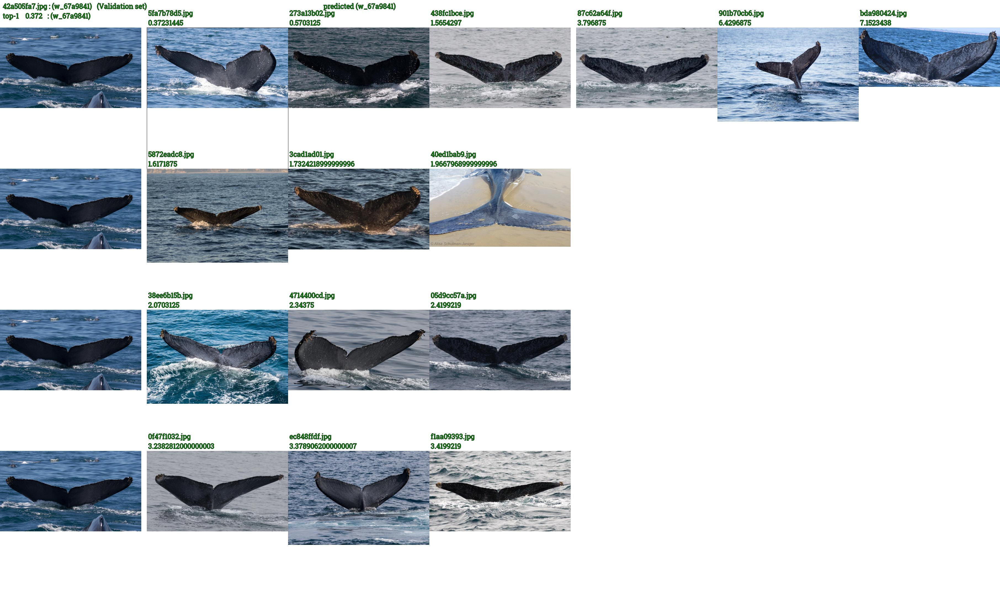
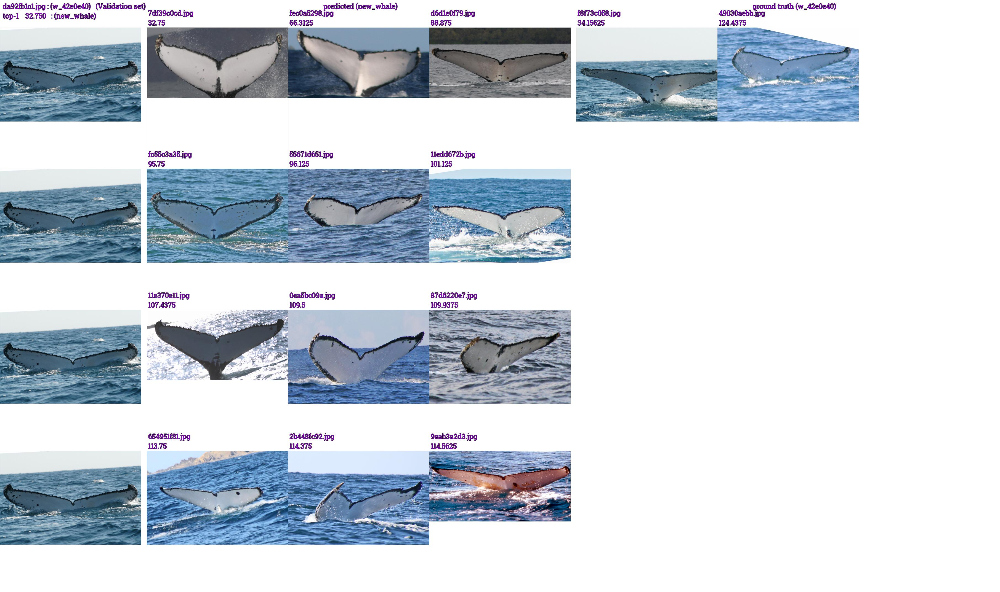
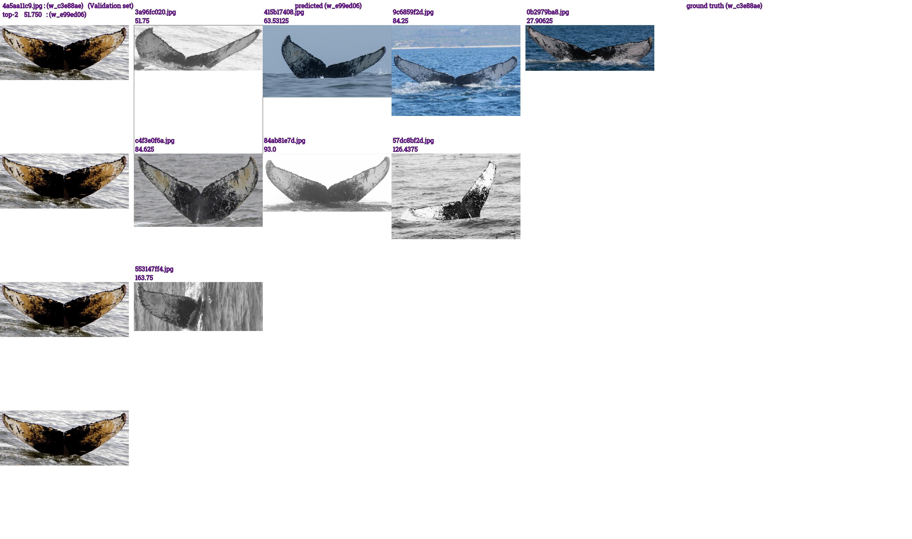
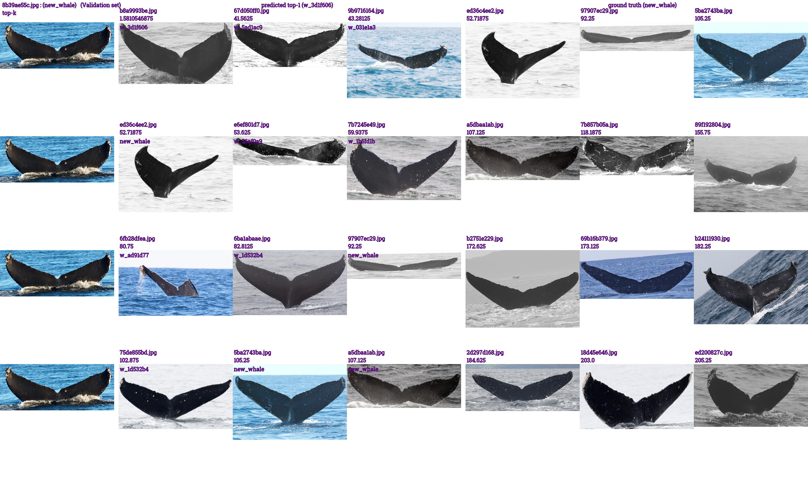

# Explore your classifier model's prediction

I've created this code to explore the performance of the metric learning NN used for the kaggle's [Humpback Whale Identification](https://www.kaggle.com/c/humpback-whale-identification). The metric deep learning model that I am using is distance based. The scores are interpreted as the distance between the image that we are testing with other images which  belong to known classes. The distance is a measure of the similarity of features in the embedding space. 

 The function `image_matrix_draw` is going to associate two groups of images to each prediciton of your classifier's validation set predictions. When you train a NN image classifier, you want to see how it is performing. One way to check its performance, and see why it failed on those wrong images, is to checkup the validation images that have been wrongly classified and to compare it with the images of the wrong class + with the images of the ground truth class. This notebook is doing just that.
 
 The file name generated with the score being the 1st term. Which allows you to sort the file names in the folder of the top-1 correct (for instance), in ascending and you will get the most correct items in the top and most confused and barely correct images at the bottom. The same sorting is useful for top-1 incorrect folder in descending. The top files will be the most confused just barely classified wrong, and the bottom the most wrong classifications.
 
 Let's take an example:
 
**top-1 correct:** is plotting the 1st image as the top-1 predicted image (which is bounded by a rectangle). And then plots the most similar same class images in an ascending scores (from the most similar that the model think is, to the less  similar images).  The 1st column is the repeated images of the image that we are asking the model to predict. The columns 2-7 are the prediction images sorted. (The columns 5-7 are the ground truth class images sorted if the prediciton is incorrect which is not the case here)

**top-1 incorrect:** Here the incorrectly classified top-1 image. And just like before, it plots the most similar same class images in an ascending scores. This time there are ground truth images (maximum 12 images) plotted in the same way (from the most similar to the less similar)

**top-2 incorrect:**

**top-k correct:** Here the plotted images are for the top-1 predicted image then the top-2, top-3 ...etc. Ground truth class plotted too in top-k correct plots, since we cannot see enough examples of top-1 images in the columns 2-4, so I thought it would be interesting to see correct class examples.

**top-k incorrect:** 

 
 
 
All the above plots can be generated for the test set too. However, since there is no ground truth labels, it does not classify them into two correct/incorrect folders, and there are no ground truth images plotted. 
 
**P.S.:** To replicate the images above, you can run [this kernel](https://www.kaggle.com/iafoss/similarity-densenet169-0-794lb-kernel-time-limit). And add [this code](https://www.kaggle.com/iafoss/similarity-densenet169-0-794lb-kernel-time-limit#470545) to generate the pandas dataframes needed to generate these images. 

 
The function to explore the prediciton's of a classifier can be used for other metric or Siamese learning NN. It can be even used for classification models with a few modifications in the arguments passed.  

It will draw 7 columns of images. Each column has 4 images, with size (sz):
    The 1st column is composed of 4 replicates of the validation image that we want to explore.
    The 2nd to 4th column composed of images that has the same predicted class from the train set.
    The 5th to 7th column composed of images that has the same class from the ground truth label of the validation image in question.
    
    For the pred columns we have 3 states:
    # 1. sort by topk. Req. : topk == True && hasattr(val_image_df, 'nbs_Image')
    # 2. sort by class. Req.: topk == False (or hasattr(val_image_df, 'nbs_Image')=False) &&  trn_vs_val_df is not None
    # 3. unsorted randomly picked from pred class.
    
    # For the ground truth columns:
    # 1. sort by class (pred_sorted_by_class = True). Req.: trn_vs_val_df is not None
    # 2. unsorted randomly picked from pred class (pred_sorted_by_class = False)
    
    Parameters:
    val_image_df    :    pandas series that has the following information about the validation/test image:
                            Image     : file name of the validation images
                            Id        : ground truth label (if Id is not present, the function will regard the images to be analyzed as test images instead of validation images)
                            nbs       : predicted labels (space separated if multiple labels provided for multiple topk=True
                                         e.g., 100 of labels in one column otherwise only one).
                            d         : score  (space separated if multiple labels provided for multiple topk=True
                                         e.g., 100 of labels in one column otherwise only one)
                            nbs_Image : file names of Images of the predicted labels (space separated in one column). If this column not provided, 
                                        randomly picked images will be provided of the predicted class instead of sorted from low to high score or in reverse (even if topk = True)

    train_df        :    pandas dataframe of the whole dataset's labels (train without validation) contain the following columns:
                            Image: file name
                            Id   : label
                            
    trn_vs_val_df   :    pandas dataframe matrix of scores between all train images and validation images. 
                         If provided, the function will plot in the columns of the ground truth the images that belongs to the ground truth label
                         sorted (either ascending or descending) by scores of the validation image in question vs train ground truth class images.
                         Columns:
                            Image     : file name of the train images
                            Id        : ground truth label 
                            file names: multiple columns: each column for each validation file name
    
    topk            :    True         : Plotting the images of the top-1, top-2, top-3  ...  instead of analyzing only one of the top-k
                         False        : Analyzing the top-1 score or top-2 or top-3 ...etc. Which top-k score is chosen is determined by the 
                                        val_image_df data of which top-k that is passed to this function
                        
    ascending       :    sorting scores from low to high if True (e.g., for sorting nearest negihbours), or sorting from High to low if Flase (e.g., sorting according to accuracy scores)                   
    dcut            :    if score > dcut assign dcut_label to the predictions if ascending = True
                         if score < dcut assign dcut_label to the predictions if ascending = False
    SZ              :    Size of each image
    MRGN            :    Size of the margin between the major 3 columns (validation column + predicted class images column, ground truth class images column)
    SMALL_MRGN      :    Size of the margin between the each columns of the 7 columns
    BKGR_COLOR      :    Background color 
    HDR             :    Height of the header of the total image
    INPUT_PATH      :    Path of the whole dataset images
    Font            :    Font of the written text 
    FNT_SZ          :    Font size
    
    TODO: ascending = False
    dcut <> 0 and dcut_label <>'' else if dcut <>0 and dcut_label ='' raise error
